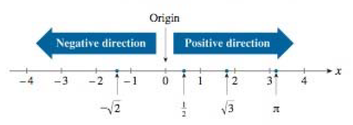
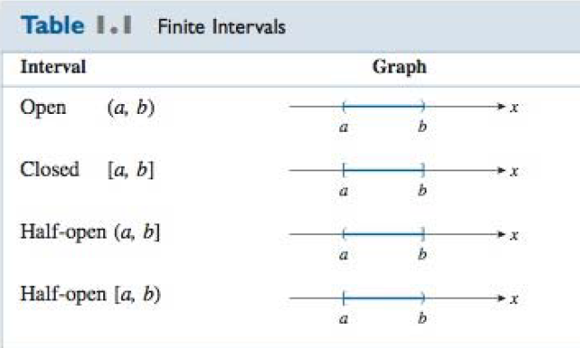
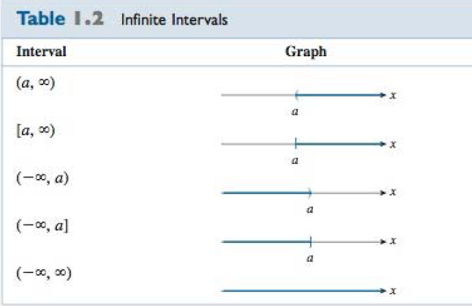
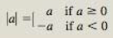

2020年2月7日 - MATH157

Cartesian coordinate system 直角坐标系

line-of-best-fit 最佳拟合线

# Precalculus Review 

## The Real Number Line / coordinate line 一维坐标系

**real number line / coordinate line** - real numbers may be represented geometrically by points on a line. 

#### 一维坐标系的建立

* arbitrarily select a point on a straight line to represent the number 0. This point is called the **origin**. 
* If the line is horizontal, then a point at a convenient distance to the right of the origin is chosen to represent the number 1. This determines the scale for the number line. 
* Each positive real number lies at an appropriate distance to the right of the origin.
* Each negative real number lies at an appropriate distance to the left of the origin. 
* The number 0 itself is neither positive nor negative. 

#### 性质

* A one-to-one correspondence is set up between the set of all real numbers and the set of points on the number line. 
* exactly one point on the line is associated with each real number. 
* exactly one real number is associated with each point one the line. 
* the real number that is associated with a point on the real number line is called the **coordinate** of that point. [与实线上的点关联的实数成为该点的坐标]

## Intervals

#### open interval

* The set of all real numbers that lie strictly between two fixed numbers a and b is called an **open interval (a,b)**. 
  * It consists of all real numbers x that satisfy the inequalities a<x<b.
  * it is called "open" because neither of its end points is included in the interval. 

#### closed interval

* a **closed interval** contains both of its end points. 
  * the set of all real numbers x that satisfy the inequalities a≤x≤b is the closed interval [a,b]. 
  * notice that square brackets are used to indicate that the end points are included in this interval. 

#### Half-open intervals

* **Half-open intervals** contain only one of their end points. 
  * the interval [a,b) is the set of all real numbers x that satisfy a≤x<b. 

***以上三种都叫做finite intervals***

***相对的，还有infinite intervals.*** 

The symbol ∞, called **infinity**, is not a real number. (It is used here only for notational purposes in conjunction with the definition of infinite intervals)

The notation (-∞,∞) is used for the set of all real numbers x since, by definition, the inequalities -∞<x<∞ hold for any real number x. 

## Properties of Inequalities

If a, b, and c are real numbers, then:

* If a<b and b<c, then a<c.
* If a<b, then a+c<b+c.
* If a\<b and c>0, then ac<bc. 
* If a<b and c<0, then ac>bc.
* 带等号的也成立

* A real number is a **solution of an inequality*** involving a variable if a true statement is obtained when the variable is replaced by that number. 
* The set of all real numbers satisfying the inequality is called the **solution** set. 

## Absolute Value 

#### distance 

- suppose we want to know how far away a real number a is from the origin, we calculate the **distance** between a and zero by subtracting the smaller number from the larger number. (This process ensures that the distance is always positive.)

* The number zero is of course zero distance away from itself. 
* the number zero does not have a sign, as it is neither positive nor negative. 

#### Absolute value 

The absolute value of a number a is denoted by |a| and is defined by 

* Since -a is a positive number when a is negative, it follows that the absolute value of a number is always non-negative. 

##### properties

* \|-a| = |a| 

* \|ab| = |a||b|

* \|a/b| = |a|/|b| (b≠0)
* \|a+b| ≤ |a|+|b|  (triangle inequality三角不等式)

#### distance between two numbers

* the distance between any two real numbers a and b is given by |a-b|.

## Exponents and Radicals 指数和根数

* **exponents** - if b is any real number and n is a positive integer, then the expression b^n^ is defined as the number b^n^ = b·b·b·...·b (n factors)
  * the number b is called the **base**
  * the superscript n is called the **power** of the exponential expression b^n^. 
  * If b≠0, we define b^0^ = 1. 
  * but, 0^0^ is not defined. 
* **radicals** - if n is a positive integer, then the expression b^1/n^ is defined to be the number that, when raised to the **nth power**, is equal to b. 
  * (b^1/n^)^n^ = b. such a number, if it exists, is called the nth root of b, also written $"\sqrt[n]{b}"$
  * the nth root of a negative number is not defined when n is even. 